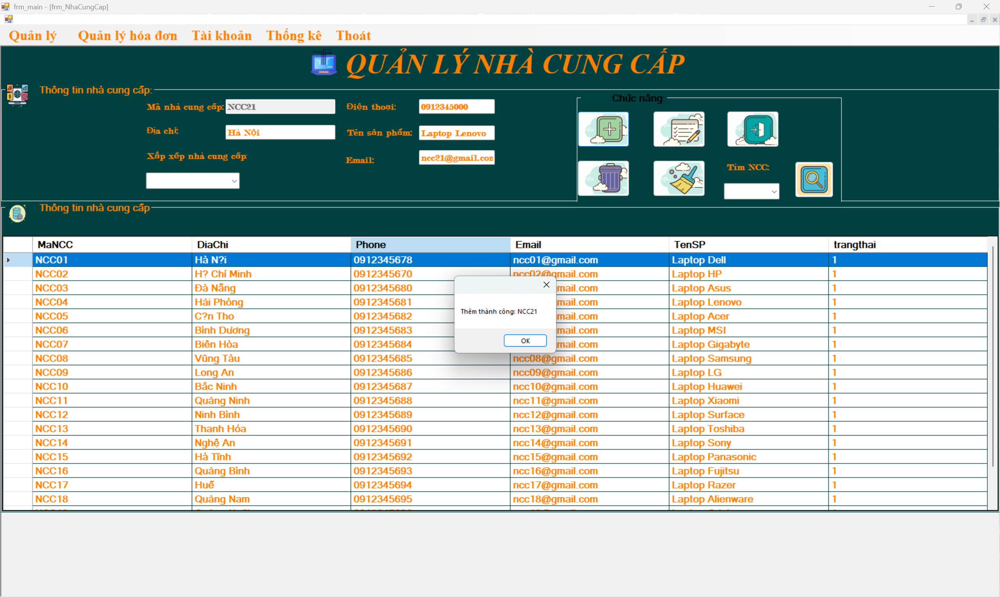
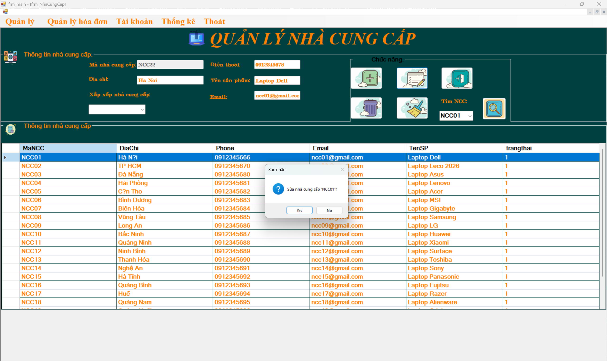
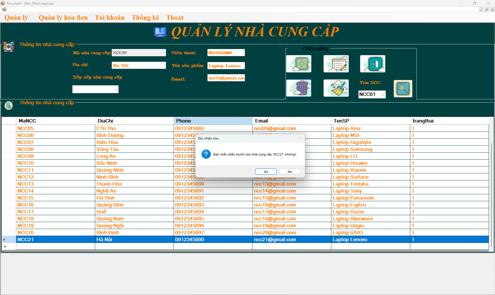
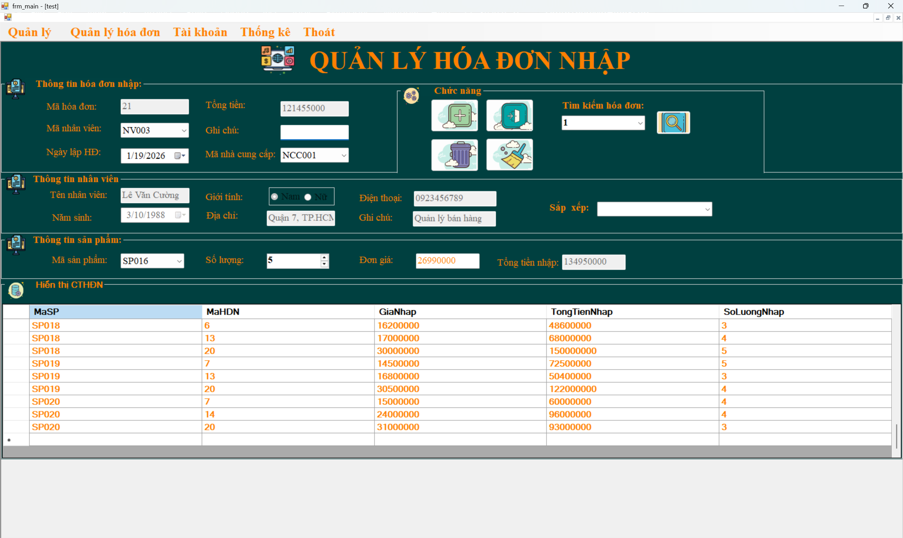
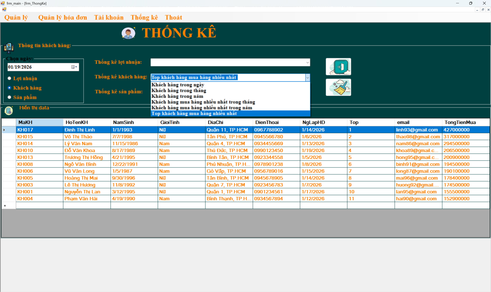
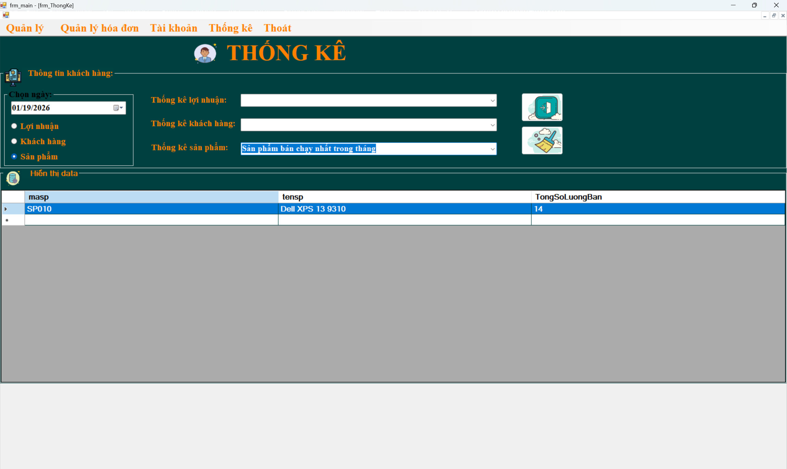
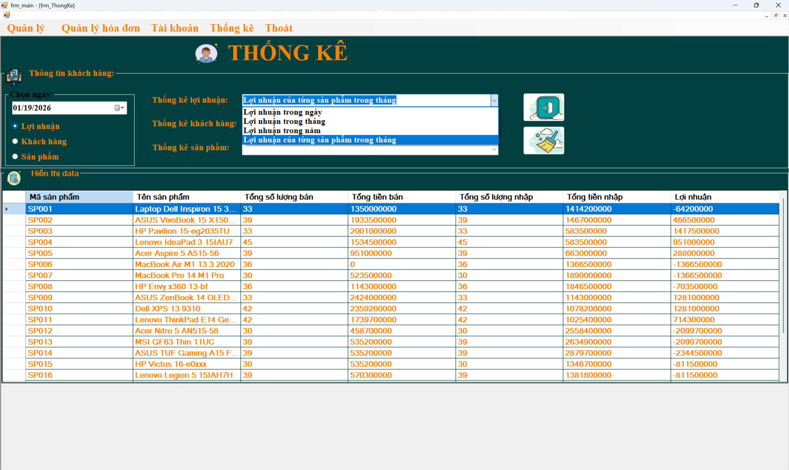

# WinForms Sales Management Application

A desktop application built with **C# WinForms** for managing laptop sales, including product management, sales invoicing, import invoicing (stock receiving), supplier management, customer management, and basic sales statistics & reports.

This project was developed as a personal/academic project to practice desktop application development and SQL Server database integration.

---

## Author & Contributions
**Phan Văn** – **Main Developer / Student**

- Designed and implemented the entire user interface (UI) using WinForms
- Built the SQL Server database schema (tables for products, customers, suppliers, sales invoices, import invoices, invoice details, inventory, etc.)
- Developed core modules:
  - **Supplier Management**: Add, edit, delete, and view supplier list
  - **Import Invoices (Stock Receiving / Purchase Orders)**: Create import invoices from suppliers, add import details (products, quantities, prices), automatically update inventory stock levels
  - **Statistics & Reports**:
    - Customer statistics (sales by customer, purchase volume)
    - Product statistics (sales quantity, remaining stock, best-selling products)
    - Profit statistics (revenue, cost of goods, profit over time periods)
- Integrated data access using **ADO.NET** (SqlConnection, SqlCommand, SqlDataAdapter, etc.)
- Captured and added all screenshot images to demonstrate the features

---

## Features
- Manage laptop products (add, update, delete)
- Supplier management (add, edit, delete suppliers)
- Customer management and sales invoice creation
- Import invoice management (receive goods from suppliers and update stock)
- Basic statistics and reports:
  - By customer
  - By product
  - Profit overview
- SQL Server database integration

---

## Technologies Used
- **Language**: C#
- **UI Framework**: Windows Forms (.NET Framework)
- **Database**: SQL Server
- **Data Access**: ADO.NET

---

## Screenshots

### Login Screen

### Supplier Management
| Add Supplier              | Edit Supplier             | Delete Supplier           |
|---------------------------|---------------------------|---------------------------|
|  |  |  |

### Import Invoice (Import Details)

### Statistics & Reports
| Customer Statistics       | Product Statistics        | Profit Statistics         |
|---------------------------|---------------------------|---------------------------|
|  |  |  |
